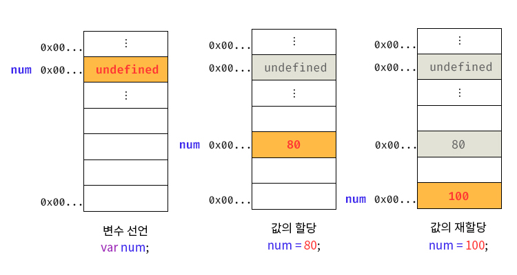

# 4장. 변수

## 4.1 변수란 무엇인가? 왜 필요한가?



`변수`는 데이터를 저장하기 위해 확보한 메모리 공간 자체 또는 그 메모리 공간을 식별하기 위해 붙인 이름을 뜻한다. 쉽게 말해, 변수는 값의 위치를 가리키는 상징적인 이름이다. 변수는 프로그램이 실행되는 동안 데이터를 임시로 저장하고 조작할 수 있도록 도와준다. 변수를 사용하면 복잡한 계산 결과를 저장하거나, 사용자 입력을 기억하거나, 상태를 추적하는 등의 작업을 수행할 수 있다.

### 변수가 필요한 이유:

1. **`데이터 저장 및 관리`**: 변수는 데이터를 저장할 수 있는 공간을 제공하여 프로그램이 데이터를 효과적으로 관리할 수 있도록 한다.
2. **`코드 가독성 향상`**: 변수 이름을 통해 코드의 의미를 명확히 할 수 있어 코드의 가독성을 높이고 유지보수를 쉽게 만든다.

## 4.2 식별자

`식별자는` 어떤 값을 구별해서 식별할 수 있는 고유한 이름을 말한다. `변수`, `함수`, `속성` 등을 구분하는 이름으로 사용된다. 중요한 점은 식별자가 값 자체를 저장하는 것이 아니라, 메모리 주소를 기억하고 있다는 것이다. 즉, 식별자는 특정 메모리 위치에 접근할 수 있게 해주는 `참조(reference) 역할`을 한다.

### 식별자 네이밍 규칙:

1. **문자와 숫자**, **언더스코어**(\_), 달러 기호($)로 구성될 수 있다.
2. **숫자로 시작할 수 없다.**
3. **예약어**(예: `var`, `let`, `const`, `if`, `while` 등)는 식별자로 사용할 수 없다.
4. **대소문자를 구분**하며, 예를 들어 `myVar`와 `myvar`는 다른 식별자로 인식된다.

## 4.3 변수 선언

변수 선언은 값을 저장하기 위한 메모리 공간을 확보하고, 변수 이름과 확보된 메모리 공간의 주소를 연결하여 값을 저장할 수 있게 준비하는 과정이다. 자바스크립트에서 변수 선언 시에는 `var`, `let`, `const` 키워드를 사용한다. 이들은 각각 변수를 선언하고 관리하는 방식이 다르다.

### 변수 선언의 단계:

1. **`선언 단계`**: 변수 이름을 등록하여 자바스크립트 엔진에 변수의 존재를 알립니다. 이는 변수의 스코프(범위)도 정의합니다. (ex: let singer, var num)
2. **`초기화 단계`**: 값을 저장하기 위한 메모리 공간을 확보하고, 암묵적으로 `undefined`를 할당해 초기화합니다. 초기화를 하지 않으면 이전에 다른 프로그램이 사용했던 쓰레기 값이 남아 있을 수 있다.

```jsx
// 선언 단계: 자바스크립트 엔진은 'singer' 변수를 스코프에 등록한다.
// 초기화 단계: 이 시점에서는 아직 초기화되지 않았다.
let singer;

console.log(singer); // 출력: undefined
// 초기화가 완료되기 전까지는 undefined가 할당된다.

// 값 할당 (초기화 완료)
singer = "Adele";
console.log(singer); // 출력: Adele
```

### 키워드에 따른 특징:

- **`var`**: 선언과 초기화가 동시에 이루어진다. 따라서 변수를 선언하기 전에 참조해도 에러가 발생하지 않으며 `undefined` 값을 반환한다. `var`는 함수 스코프를 가진다.

  ```jsx
  // 변수 선언 이전에 접근 시도
  console.log(myVar); // 출력: undefined (호이스팅으로 인해 선언은 끌어올려지고 초기화는 undefined로 초기화됨)

  // 변수 선언 및 초기화
  var myVar = 10;
  console.log(myVar); // 출력: 10

  // 함수 스코프 예시
  function testVar() {
    var localVar = "I'm local";
    console.log(localVar); // 출력: I'm local
  }
  testVar();
  // console.log(localVar); // ReferenceError: localVar is not defined (함수 외부에서 접근 불가)
  ```

- **`let`**: 선언 단계와 초기화 단계가 분리되어 진행된다. 변수 선언 이전에 접근하려고 하면 참조 에러가 발생한다. `let`은 블록 스코프를 가진다.

  ```jsx
  // 변수 선언 이전에 접근 시도
  // console.log(myLet); // ReferenceError: Cannot access 'myLet' before initialization (일시적 사각지대)

  // 변수 선언
  let myLet = 20;
  console.log(myLet); // 출력: 20

  // 블록 스코프 예시
  if (true) {
    let blockScoped = "I'm block scoped";
    console.log(blockScoped); // 출력: I'm block scoped
  }
  // console.log(blockScoped); // ReferenceError: blockScoped is not defined (블록 외부에서 접근 불가)
  ```

- **`const`**: 상수 개념으로, 변수 선언과 동시에 초기화해야 하며 이후 값을 재할당할 수 없다. 또한 블록 스코프를 가지며, 선언 전에 접근하려고 하면 참조 에러가 발생한다.

  ```jsx
  // 변수 선언과 동시에 초기화 필요
  const myConst = 30;
  console.log(myConst); // 출력: 30

  // 재할당 시도
  // myConst = 40; // TypeError: Assignment to constant variable. (재할당 불가)

  // 블록 스코프 예시
  if (true) {
    const blockConst = "I'm also block scoped";
    console.log(blockConst); // 출력: I'm also block scoped
  }
  // console.log(blockConst); // ReferenceError: blockConst is not defined (블록 외부에서 접근 불가)
  ```

## 4.4 변수 선언의 실행 시점과 변수 호이스팅

변수 선언의 실행 시점은 런타임이 아닌 그 이전 단계에서 이루어진다. 자바스크립트 엔진은 소스코드를 실행하기 전에 소스코드의 평가 과정을 거친다. 이 과정에서 변수 선언을 포함한 모든 선언문을 미리 찾아내어 실행한다. 이러한 과정 때문에 `호이스팅(hoisting`)이라는 특징이 나타난다.

### 자바스크립트의 평가 과정

1. **`선언문 탐색`**: 자바스크립트 엔진은 스코프 내의 모든 변수 선언(`var`, `let`, `const`)과 함수 선언을 찾아내어 해당 스코프에 등록합니다. 이 과정에서 변수나 함수가 어디에서든 참조될 수 있도록 호이스팅이 발생합니다.
2. **`호이스팅`**: 자바스크립트는 변수와 함수 선언을 코드의 최상단으로 끌어올린 것처럼 동작합니다. 즉, 실제 코드 순서와 상관없이 모든 선언문이 스코프의 맨 위에 위치한 것처럼 간주됩니다.
3. **`실행 단계`**: 평가 과정이 완료된 후에 실제 코드가 실행되기 시작합니다. 이 단계에서는 선언된 변수나 함수가 할당되고 호출됩니다.

### `호이스팅`

변수 선언문이 코드의 선두로 끌어 올려진 것처럼 동작하는 자바스크립트 고유의 특징을 말한다. 예를 들어, 아래 코드는 호이스팅 때문에 에러가 발생하지 않는다.

```jsx
console.log(score); // undefined 출력
var score;
```

위 코드는 자바스크립트 엔진에 의해 다음과 같이 해석된다:

```jsx
var score;
console.log(score); // undefined 출력
```

`let`과 `const`로 선언된 변수는 호이스팅되지만, 초기화가 이루어지기 전까지 일시적 사각지대(Temporal Dead Zone)에 머물러 있어 참조 에러가 발생한다.

```jsx
console.log(myLet); // ReferenceError: Cannot access 'myLet' before initialization
let myLet = 10;
console.log(myLet); // 출력: 10
```

## 4.5 값의 할당

변수에 값을 대입하는 것을 값의 할당이라고 한다. 할당 연산자 `=`를 사용하여 변수를 선언한 후에 값을 저장할 수 있다.

```jsx
var score;
console.log(score); // undefined 출력
score = 80; // 변수 선언과 값의 할당
console.log(score); // 80 출력
```

위 예제에서 `score` 변수는 먼저 선언되고, 이후에 80이라는 값이 할당된다. 초기화하지 않은 변수는 `undefined`라는 기본 값을 가진다.
