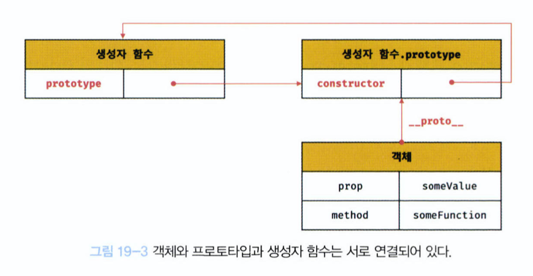
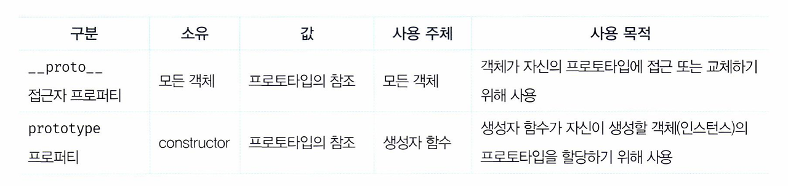
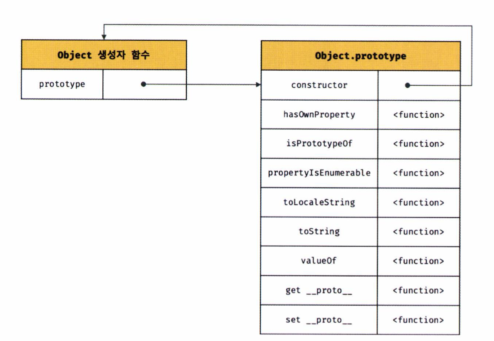
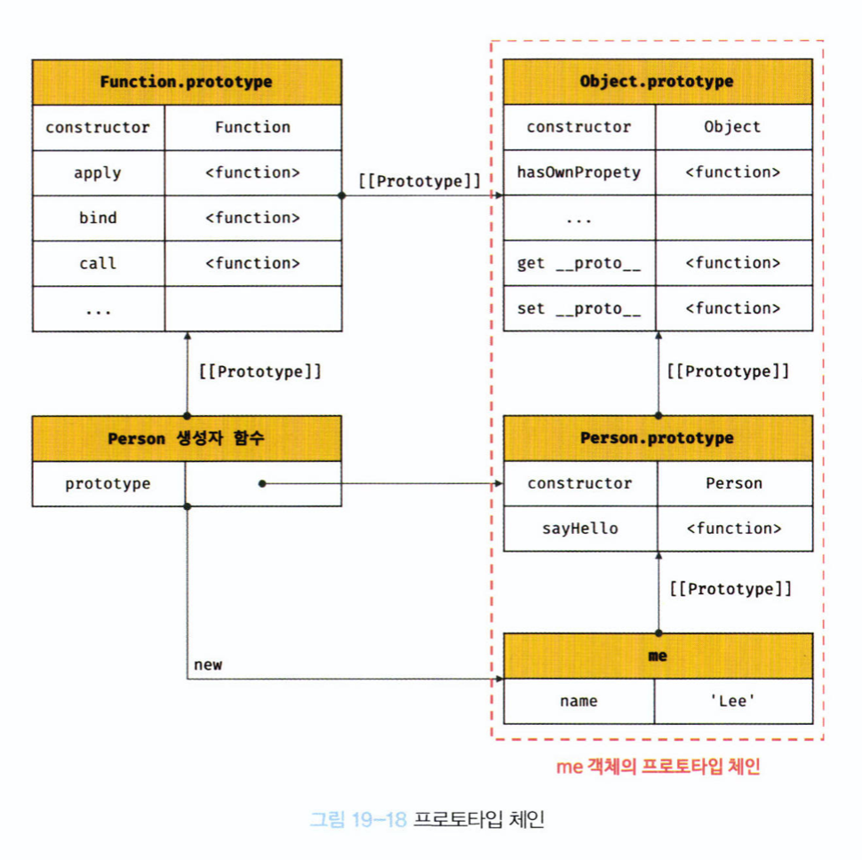
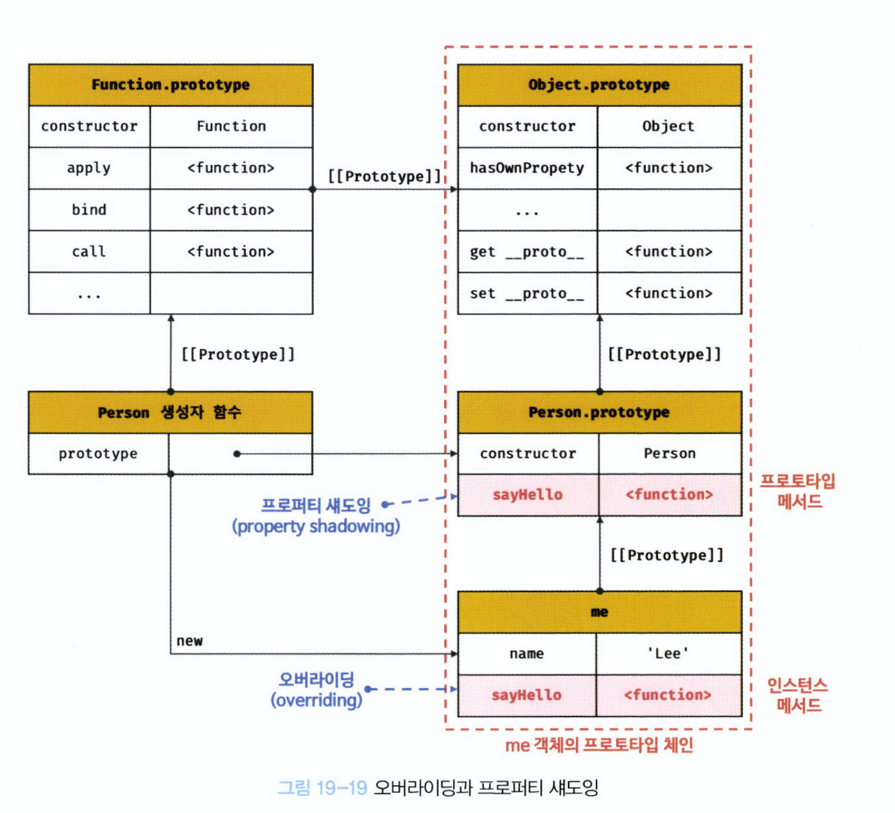
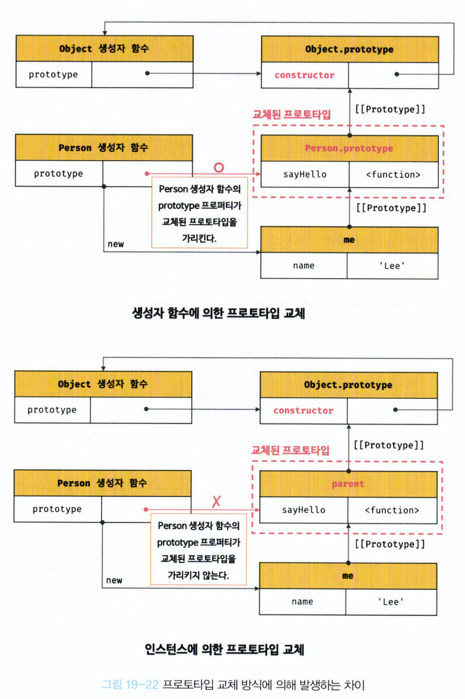

# 19. 프로토타입

자바스크립트는 **멀티 패러다임 프로그래밍 언어, 프로토타입 기반의 객체 지향 프로그래밍 언어**

- 명령형 (imperative)
- 함수형 (functional)
- 프로토타입 기반 (prototype-based)
- 객체지향 프로그래밍 (OOP; Objct Oriented Programming)

## 19.1 객체지향 프로그래밍

객체지향 프로그래밍: 프로그램을 명령어 또는 함수의 목록으로 보는 전통적인 명령형 프로그래밍의 절차지향적 관점에서 벗어나, 여러 개의 독립적 단위, 즉 **객체(object)의 집합으로 프로그램을 표현하려는 프로그래밍 패러다임**

- 실체는 속성(attribute/property)를 가짐
- 추상화(abstraciton): 프로그램이 필요한 속성만 간추려 내어 표현하는 것
- OOP는 객체의 상태(state)와 동작(behavior)을 하나의 논리적인 단위로 묶어 생각함.
  - 상태 -> 프로퍼티, 동작 -> 메서드

## 19.2 상속과 프로토타입

- 상속(inheritance) : 어떤 객체의 프로퍼티 또는 메서드를 다른 객체가 상속받아 그대로 사용할 수 있는 것. 불필요한 중복 제거.
- 자바스크립트는 프로토타입을 기반으로 상속을 구현한다.

````javascript
function Circle(radius) {
  this.radius = radius;
}

// Circle 생성자 함수가 생성한 모든 인스턴스가 getArea 메서드를 공유해서 사용할 수 있도록 프로토타입에 추가함.
// 프로토타입은 Circle 생성자 함수의 prototype 프로퍼티에 바인딩되어 있음.
Circle.prototype.getArea = function () {
  return Math.PI * this.radius ** 2;
};

const circle1 = new Circle(1);
const circle2 = new Circle(2);

// Circle 생성자 함수가 생성한 모든 인스턴스는 부모 객체의 역할을 하는 프로토타입 Circle.prototype으로부터 getArea 메서드를 상속받음. 인스턴스들은 하나의 getArea 메서드를 공유함.
console.log(circle.getArea === circle2.getArea); // true```
````

## 19.3 프로토타입 객체

객체 간 상속을 구현하기 위해 사용한다.



모든 객체는 하나의 프로토타입을 갖는다. 모든 프로토타입은 생성자 함수와 연결되어 있다.

### 19.3.1 `__proto__` 접근자 프로퍼티

모든 객체는 `__proto__` 접근자 프로퍼티를 통해 자신의 프로토타입, 즉 [[Prototype]] 내부 슬롯에 간접적으로 접근할 수 있다.

- `__proto__`는 접근자 프로퍼티다
- `__proto__` 접근자 프로퍼티는 상속을 통해 사용된다.
- `__proto__` 접근자 프로퍼티를 통해 프로토타입에 접근하는 이유
  - 상호 참조에 의해 프로토타입 체인이 생성되는 것을 방지하기 위해서.
- `__proto__` 접근자 프로퍼티를 코드 내에서 직접 사용하는 것은 권장되지 않는다.

### 19.3.2 함수 객체의 prototype 프로퍼티

함수 객체만이 소유하는 prototype 프로퍼티는 생성자 함수가 생성할 인스턴스의 프로토타입을 가리킨다.

모든 객체가 가지고 있는 (Object.prototype으로부터 상속 받은) `__proto__` 접근자 프로퍼티와 함수 객체만이 가지고 있는 prototype 프로퍼티는 결국 동일한 프로토타입을 가리킨다.
하지만 이들 프로퍼티를 사용하는 주체가 다르다.



### 19.3.3 프로토타입의 constructor 프로퍼티와 생성자 함수

- 모든 프로토타입은 constructor 프로퍼티를 갖는다. 이 constructor 프로퍼티는 prototype 프로퍼티로 자신을 참조하고 있는 생성자 함수를 가리킨다.

## 19.4 리터럴 표기법에 의해 생성된 객체의 생성자 함수와 프로토타입

리터럴 표기법에 의한 객체 생성 방식과 같이 명시적으로 new 연산자 없이 객체를 생성하는 방식이 있다.

이런 객체도 프로토타입이 존재한다. 단 이런 경우 프로토타입의 constructor 프로퍼티가 가리키는 생성자 함수가 반드시 객체를 생성한 생성자 함수라고 단정할 수 없다.

객체 리터럴이 평가되는 경우에는 OrdinaryObjectCreate를 호출하여 빈 객체를 생성하고 프로퍼티를 추가하도록 정의되어 있다.

즉 Object 생성자 함수 호출과 객체 리터럴의 평가는 추상연산 OrdinaryObjectCreate를 호출하여 빈 객체를 생성하는 점에서는 동일하지만 new.target의 확인이나 프로퍼티를 추가하는 세부 내용이 다르다.

따라서 객체 리터럴에 의해 생성된 객체는 Object 생성자 함수가 생성한 객체가 아니다.

리터럴 표기법에 의해 생성도니 객체도 상속을 위해 프로토타입이 필요하다. 해당 객체도 가상적인 생성자 함수를 갖는다. 프로토타입은 생성자 함수와 더불어 생성되며 prototype, constructor 프로퍼티에 의해 연결되어 있기 떄문이다.

즉, 프로토타입과 생성자 함수는 단독으로 존재할 수 없으며 언제나 쌍으로 존재하게 된다.

## 19.5 프로토타입의 생성 시점

프로토타입은 생성자 함수가 생성되는 시점에 더불어 생성된다.

### 19.5.1 사용자 정의 생성자 함수와 프로토타입 생성 시점

생성자 함수로서 호출할 수 있는 함수, 즉 constructor는 함수 정의가 평가되어 함수 객체를 생성하는 시점에 프로토타입도 더불어 생성된다.

```javascript
console.log(Person.prototype); // {constructor : f}

function Person(name) {
  this.name = name;
}
```

생성자 함수로서 호출할 수 없는 함수, 즉 non-constructor는 프로토타입이 생성되지 않는다.

```javascript
// 화살표 함수는 non-constructor
const Person = (name) => {
  this.name = name;
};

console.log(Person.prototype); // undefined
```

### 19.5.2 빌트인 생성자 함수와 프로토타입 생성 시점

Object, String, Nunber, Function, Array, RegExp, Date, Promise 등과 같은 빌트인 생성자 함수도 빌트인 생성자 함수가 생성되는 시점에 프로토타입이 생성된다.

모든 빌트인 생성자 함수는 전역 객체가 생성되는 시점에 생성된다.



이처럼 객체가 생성되기 이전에 생성자 함수와 프로토타입은 이미 객체화되어 존재한다.
이후 생성자 함수 또는 리터럴 표기법으로 객체를 생성하면 프로토타입은 생성도니 객체의 [[Prototype]] 내부 슬롯에 할당된다.
이로써 생성된 객체는 프로토타입을 상속받는다.

## 19.6 객체 생성 방식과 프로토타입의 결정

객체 생성 방법

- 객체 리터럴
- Object 생성자 함수
- 생성자 함수
- Object.create 메서드
- 클래스(ES6)

모든 객체는 각 방식마다 세부적인 객체 생성 방식의 차이는 있으나 추상 연산 OrdinaryObjectCreate에 의해 생성된다는 공통점이 있다.

프로토타입은 추상 연산 OrdinaryObjectCreate에 전달되는 인수에 의해 결정된다. 이 인수는 객체가 생성되는 시점에 객체 생성 방식에 의해 결정된다.

### 19.6.1 객체 리터럴에 의해 생성된 객체의 프로토타입

객체 리터럴에 의해 생성되는 객체의 프로토타입: Object.prototype

```javascript
const obj = { x: 1 };

console.log(obj.constructor === Object); // true
console.log(obj.hasOwnProperty("x")); // true
```

### 19.6.2 Object 생성자 함수에 의해 생성된 객체의 프로토타입

Object 생성자 함수에 의해 생성된 객체의 프로토타입: Object.prototype

```javascript
const obj = new Object();
obj.x = 1;

console.log(obj.constructor === Object); // true
console.log(obj.hasOwnProperty("x")); // true
```

### 19.6.3 생성자 함수에 의해 생성된 객체의 프로토타입

생성자 함수에 의해 생성된 객체의 프로토타입: 생성자 함수의 prototype 프로퍼티에 바인딩되어 있는 객체

```javascript
function Person(name) {
  this.name = name;
}

// 프로토타입 메서드
Person.prototype.sayHello = function () {
  console.log(`Hi! My name is ${this.name}`);
};

const me = new Person("Choi");

me.sayHello();
```

Person 생성자 함수를 통해 생성된 모든 객체는 프로토타입에 추가된 sayHello 메서드를 상속받아 자신의 메서드처럼 사용할 수 있다.

## 19.7 프로토타입 체인

```javascript
function Person(name) {
  this.name = name;
}

// 프로토타입 메서드
Person.prototype.sayHello = function () {
  console.log(`Hi! My name is ${this.name}`);
};

const me = new Person("Choi");

// hasOwnProperty는 Object.prototype의 메서드
console.log(me.hasOwnProperty("name")); // true
```

Person 생성자 함수에 의해 생성된 me 객체는 Object.prototype의 메서드인 hasOwnProperty를 호출할 수 있다. 이는 me 객체가 Person.prototype뿐만 아니라 Object.prototype도 상속받았따는 것을 의미한다.

```javascript
Object.getPrototypeof(me) === Person.prototype; // true
Object.getPrototypeof(Person.prototype) === Object.prototype; // true
```

Person.prototype의 프로토타입은 Object.prototype이다. 프로토타입의 프로토타입은 언제나 Object.prototype이다.



**프로토타입 체인**: 자바스크립트는 객체의 프로퍼티에 접근하려고 할 때 해당 객체에 접근하려는 프로퍼티가 없다면, [[Prototype]]의 내부 슬롯의 참조를 따라 자신의 부모 역할을 하는 프로토타입의 프로퍼티를 순차적으로 검색한다. 이를 프로토타입 체인이라고 하며, 객체지향 프로그래밍의 상속을 구현하는 메커니즘이다.

Object.prototype을 프로토타입 체인의 종점(end of prototype chain)이라 한다.
프로토타입 체인의 종점인 Object.prototype에서도 프로퍼티를 검색할 수 없는 경우 undefined를 반환하게 된다.

## 19.8 오버라이딩과 프로퍼티 섀도잉

```javascript
const Person = (function () {
  // 생성자 함수
  function Person(name) {
    this.name = name;
  }

  // 프로토타입 메서드
  Person.prototype.sayHello = function () {
    console.log(`Hi! My name is ${this.name}`);
  };

  // 생성자 함수를 반환
  return Person;
})();

const me = new Person("Lee");

// 인스턴스 메서드
me.sayHello = function () {
  console.log(`Hey! My name is ${this.name}`);
};

// 인스턴스 메서드가 호출된다. 프로토타입 메서드는 인스턴스 메서드에 의해 가려진다.
me.sayHello(); // Hey! My name is Lee
```

프로토타입 프로퍼티와 같은 이름의 프로퍼티를 인스턴스에 추가하면 프로토타입 체인을 따라 프로토타입 프로퍼티를 검색하여 프로토타입 프로퍼티를 덮어쓰는 것이 아니라 인스턴스 프로퍼티로 추가한다.

이때 인스턴스 메서드 sayHello는 프로토타입 메서드 sayHello를 **오버라이딩**했고 프로토타입 메서드 sayHello는 가려진다.

이처럼 상속 관계에 의해 프로퍼티가 가려지는 현상을 **프로퍼티 섀도잉**이라고 한다.

**오버라이딩**: 상위 클래스가 가지고 있는 메서드를 하위 클래스가 재정의하여 사용하는 방식

> _오버로딩: 함수의 이름은 동일하지만 매개변수의 타입 또는 개수가 다른 메서드를 구현하고 매개변수에 의해 메서드를 구별하여 호출하는 방식. JS는 오버로딩을 지원하지 않지만 arguments 객체를 사용하여 구현할 수는 있다._



프로퍼티를 삭제하는 경우도 마찬가지다.
위 예제에서 추가한 인스턴스 메서드 sayHello를 삭제하면, 프로토타입 메서드가 아닌 인스턴스 메서드 sayHello가 삭제된다.

```javascript
// 인스턴스 메서드를 삭제한다.
delete me.sayHello;
// 인스턴스에는  sayHello 메서드가 없으므로 프로토타입 메서드가 호출된다.
me.sayHello(); // Hi! My name is Lee

// 프로토타입 체인을 통해 프로토타입 메서드가 삭제되지 않는다.
delete me.sayHello;
// 프로토타입 메서드가 호출된다.
me.sayHello(); // Hi! My name is Lee

// 프로토타입 메서드 변경
Person.prototype.sayHello = function () {
  console.log(`Hey! My name is ${this.name}`);
};
me.sayHello(); // Hey! My name is Lee

// 프로토타입 메서드 삭제
delete Person.prototype.sayHello;
me.sayHello(); // TypeError: me.sayHello is not a function
```

하위 객체를 통해 프로토타입의 프로퍼티를 변경 또는 삭제하는 것은 불가능하다.
하위 객체를 통해 프로토타입에 get 액세스는 허용되나 set 액세스는 허용되지 않는다.

프로토타입 프로퍼티를 변경 또는 삭제하려면 하위 객체를 통해 프로토타입 체인으로 접근하는 것이 아니라 프로토타입에 직접 접근해야 한다.

## 19.9 프로토타입의 교체

프로토타입은 임의의 다른 객체로 변경할 수 있다.
이는 부모 객체인 프로토타입을 동적으로 변경할 수 있음을 의미한다.

### 19.9.1 생성자 함수에 의한 프로토타입의 교체

```javascript
const Person = (function () {
  function Person(name) {
    this.name = name;
  }

  // ① 생성자 함수의 prototype 프로퍼티를 통해 프로토타입을 교체
  Person.prototype = {
    sayHello() {
      console.log(`Hi! My name is ${this.name}`);
    },
  };

  return Person;
})();

const me = new Person("Lee");

// 생성자 함수의 constructor와 연결 끊김
console.log(me.constructor === Person); // false
console.log(me.constructor === Object); // true
```

프로토타입으로 교체한 객체 리터럴에는 constructor 프로퍼티가 없다.
constructor 프로퍼티는 JS엔진이 프로토타입을 생성할 때 암묵적으로 추가한 프로퍼티이기 때문.
따라서 me 객체의 생성자 함수를 검색하면 Person이 아닌 Object가 나온다.

이처럼 프로토타입을 교체하면 constructor 프로퍼티와 생성자 함수 간 연결이 파괴된다. 프로토타입으로 교체한 객체 리터럴에 constructor 프로퍼티를 추가하면 이를 되살릴 수 있다.

```javascript
const Person = (function () {
  function Person(name) {
    this.name = name;
  }

  // 생성자 함수의 prototype 프로퍼티를 통해 프로토타입을 교체
  Person.prototype = {
    // constructor 프로퍼티와 생성자 함수 간의 연결을 설정
    constructor: Person,
    sayHello() {
      console.log(`Hi! My name is ${this.name}`);
    },
  };

  return Person;
})();

const me = new Person("Lee");

// constructor 프로퍼티가 생성자 함수를 가리킨다.
console.log(me.constructor === Person); // true
console.log(me.constructor === Object); // false
```

### 19.9.2 인스턴스에 의한 프로토타입의 교체

인스턴스의 `__proto__` 접근자 프로퍼티를 통해서도 프로토타입을 교체할 수 있다.

생성자 함수의 prototype 프로퍼티에 다른 임의의 객체를 바인딩하는 것은 미래에 생성할 인스턴스의 프로토타입을 교체하는 것이지만, `__proto__` 접근자 프로퍼티를 통해 프로토타입을 교체하는 것은 이미 생성된 객체의 프로토타입을 교체하는 것이다.

```javascript
function Person(name) {
  this.name = name;
}

const me = new Person("Lee");

// 프로토타입으로 교체할 객체
const parent = {
  sayHello() {
    console.log(`Hi! My name is ${this.name}`);
  },
};

// ① me 객체의 프로토타입을 parent 객체로 교체한다.
Object.setPrototypeOf(me, parent);
// 위 코드는 아래의 코드와 동일하게 동작한다.
// me.__proto__ = parent;

me.sayHello(); // Hi! My name is Lee

// 생성자 함수와의 연결 끊어짐
console.log(me.constructor === Person); // false
console.log(me.constructor === Object); // true
```



따라서 프로토타입 교체를 통해 객체 간의 상속 관계를 동적으로 변경하는 것은 번거롭다. 따라서 프로토타입은 직접 교체하지 않는 것은 좋다.
상속 관계를 인위적으로 설정하려면, '직접 상속'이나 ES6의 클래스를 통해 구현하는 것이 좋다.

## 19.10 instanceof 연산자

instanceof 연산자

- 이항 연산자로서 좌변에 객체를 가리키는 식별자, 우변에 생성자 함수를 가리키는 식별자를 피연산자로 받는다.
- 우변의 생성자 함수의 prototype에 바인딩된 객체가 좌변의 객체의 프로토타입 체인 상에 존재하면 true로 평가되고, 그렇지 않은 경우에는 false로 평가된다.

```javascript
// 생성자 함수
function Person(name) {
  this.name = name;
}

const me = new Person("Lee");

// Person.prototype이 me 객체의 프로토타입 체인 상에 존재하므로 true로 평가된다.
console.log(me instanceof Person); // true

// Object.prototype이 me 객체의 프로토타입 체인 상에 존재하므로 true로 평가된다.
console.log(me instanceof Object); // true
```

## 19.11 직접 상속

### 19.11.1 Object.create에 의한 직접 상속

Object.create 메서드는 명시적으로 프로토타입을 지정하여 새로운 객체를 생성한다. Object.create 메서드도 다른 객체 생성 방식과 마찬가지로 OrdinaryObjectCreate를 호출한다.

Object.create 메서드의 첫번째 매개변수에는 생성할 객체의 프로토타입으로 지정할 객체를 전달한다. 두번째 매개변수에는 생성할 객체의 프로퍼티 키와 프로퍼티 디스크립트 객체로 이뤄진 객체를 전달한다. 두 번째 인수는 생략 가능하다.

```javascript
// 프로토타입이 null인 객체를 생성한다. 생성된 객체는 프로토타입 체인의 종점에 위치한다.
// obj -> null
let obj = Object.create(null);
console.log(Object.getPrototypeOf(obj) === null); //true
//Object.prototype을 상속받지 못한다.
console.log(obj.toString()); // TypeError: obj.toString is not a function

// obj -> Object.prototype => null
// obj = {};와 동일
obj = Object.create(Object.prototype);
console.log(Object.getPrototypeOf(obj) === Object.prototype); // true

// obj -> Object.prototype -> null
// obj = { x: 1 };와 동일
obj = Object.create(Object.prototype, {
   x: {value: 1, writable: true, enumerable: true; configurable: true}
});
// 위 코드는 아래와 동일하다.
// obj = Object.create(Object.prototype);
// obj.x = 1;
console.log(obj.x); // 1
console.log(Object.getPrototypeOf(obj) === Object.prototype); // true

const myProto = { x: 10 };
// 임의의 객체를 직접 상속받는다.
// obj -> myProto -> Object.prototype -> null
obj = Object.create(myProto);
console.log(Object.getPrototypeOf(obj) === myProto); // true

// 생성자 함수
function Person(name) {
   this.name = name;
}

// obj -> Person.prototype -> Object.prototype -> null
// obj = new Person('Lee')와 동일
obj = Object.create(Person.prototype);
obj.name = 'Lee';
console.log(obj.name); // Lee
console.log(Object.getPrototypeOf(obj) === Person.prototype); // true
```

Object.create 메서드는 첫 번째 매개변수에 전달한 객체의 프로토타입 체인에 속하는 객체를 생성한다. 즉 객체를 생성하면서 직접적으로 상속을 구현한다.

이 메서드의 장점은

1. new 연산자 없이 객체 생성 가능
2. 프로토타입을 지정하며 객체 생성 가능
3. 객체 리터럴에 의해 생성된 객체도 상속이 가능

Object.prototype의 빌트인 메서드들은 모든 객체의 프로토타입 체인의 종점이므로 모든 객체가 상속받을 수 있다.

하지만 ESLint에서는 Object.prototype의 빌트인 메서드를 객체가 직접 호출하는 것을 권장하지 않는데, 그 이유는 Object.create 메서드를 통해 프로토타입 체인의 종점에 위치하는 객체를 생성할 수 있기 때문이다.

프로토타입 체인의 종점에 위치하는 객체는 Object.prototype의 빌트인 메서드를 사용할 수 없다.

### 19.11.2 객체 리터럴 내부에서 `__proto__`에 의한 직접 상속

Object.create 메서드에 의한 직접 상속은 여러 장점이 있지만, 두번째 인자로 프로퍼티를 정의하는 것은 번거롭다.
ES6에서는 객체 리터럴 내부에서 `__proto__`에 의한 직접 상속을 구현할 수 있다.

```javascript
const myProto = { x: 10 };

// 객체 리터럴에 의해 객체를 생성하면서 프로토타입을 지정하여 직접 상속받을 수 있다.
const obj = {
  y: 20,
  // 객체를 직접 상속받는다.
  // obj → myProto → Object.prototype → null
  __proto__: myProto,
};
/* 위 코드는 아래와 동일하다.
const obj = Object.create(myProto, {
  y: { value: 20, writable: true, enumerable: true, configurable: true }
});
*/

console.log(obj.x, obj.y); // 10 20
console.log(Object.getPrototypeOf(obj) === myProto); // true
```

## 19.12 정적 프로퍼티/메서드

정적 프로퍼티/메서드: 생성자 함수로 인스턴스를 생성하지 않아도 참조/호출할 수 있는 프로퍼티/메서드

```javascript
// 생성자 함수
function Person(name) {
  this.name = name;
}

// 프로토타입 메서드
Person.prototype.sayHello = function () {
  console.log(`Hi! My name is ${this.name}`);
};

// 정적 프로퍼티
Person.staticProp = "static prop";

// 정적 메서드
Person.staticMethod = function () {
  console.log("staticMethod");
};

const me = new Person("Lee");

// 생성자 함수에 추가한 정적 프로퍼티/메서드는 생성자 함수로 호출한다.
Person.staticMethod(); // staticMethod

// 정적 프로퍼티/메서드는 생성자 함수가 생성한 인스턴스로 참조/호출할 수 없다.
// 인스턴스로 참조/호출할 수 있는 프로퍼티/메서드는 프로토타입 체인 상에 존재해야한다.
me.staticMethod(); // TypeError: me.staticMethod is not a function
```

Person 생성자 함수는 객체이므로 자신의 프로퍼티/메서드를 소유할 수 있다.
Person 생성자 함수 객체가 소유한 프로퍼티/메서드를 정적 프로퍼티/메서드라고 한다.
정적 프로퍼티/메서드는 생성자 함수가 생성한 인스턴스로 인스턴스로 참조/호출이 불가능하다.

만약 인스턴스/프로토타입 메서드 내에서 this를 사용하지 않는다면 그 메서드는 정적 메서드로 변경할 수 있다.

```javascript
function Foo() {}

// 프로토타입 메서드
// this를 참조하지 않는 프로토타입 메소드는 정적 메서드로 변경해도 동일한 효과를 얻을 수 있다.
Foo.prototype.x = function () {
  console.log("x");
};

const foo = new Foo();
// 프로토타입 메서드를 호출하려면 인스턴스를 생성해야 한다.
foo.x(); // x

// 정적 메서드
Foo.x = function () {
  console.log("x");
};

// 정적 메서드는 인스턴스를 생성하지 않아도 호출할 수 있다.
Foo.x(); // x
```

MDN 문서에서도 prototype 메서드와 정적 메서드를 분리하고 있다.

## 19.13 프로퍼티 존재 확인

### in 연산자

- 객체 내에 특정 프로퍼티가 존재하는지 여부 확인
- 확인 대상 객체가 상속받은 모든 프로토타입의 프로퍼티를 확인한다.

```javascript
console.log("toString" in person);
```

### Object.prototype.hasOwnProperty 메서드

- 인수로 전달받은 프로퍼티 키가 객체의 고유 프로퍼티 키인 경우에만 true,
- 상속받은 프로토타입의 프로퍼티 키인 경우 false

```javascript
console.log(person.hasOwnProperty("toString"));
```

## 19.14 프로퍼티 열거

### for ... in문

```javascript
const person = {
  name: "Lee",
  address: "Seoul",
};

// person 객체에 name 프로퍼티가 존재한다.
console.log("name" in person); // true
// person 객체에 address 프로퍼티가 존재한다.
console.log("address" in person); // true
// person 객체에 age 프로퍼티가 존재하지 않는다.
console.log("age" in person); // false

// person 객체에 toString이 존재하지 않지만 true가 나옴
console.log("toString" in person); // true
```

for ... in 문은 in 연산자처럼 순회 대상 객체의 프로퍼티 뿐 아니라 상속 받은 프로토타입의 프로퍼티까지 열거한다. 단 위 예제에서 알 수 있듯 toString과 같은 Object.prototype의 프로퍼티는 열거되지 않는다.
toString과 같은 메서드는 열거할 수 없도록 정의되어 있는 프로퍼티, 즉 [[Enumerable]]의 값이 false이기 때문이다.

**for ... in 문은 객체의 프로토타입 체인 상에서 존재하는 모든 프로토타입의 프로퍼티 중에서 프로퍼티 어트리뷰트 [[Enumerable]]의 값이 true인 프로퍼티를 순회하며 열거(enumeration)한다.**

for ... in 문은 프로퍼티를 열거하는 경우 순서를 보장하지 않지만 대부분의 모던 브라우저는 순서를 보장하고 숫자인 프로퍼티 키에 대해서는 정렬을 실시한다.

배열에는 for ... in 문을 사용하지 말고 일반적인 for 문이나 for ... of 문, Array.prototype.forEach 메서드를 사용하기를 권장한다. 배열도 객체이므로 프로퍼티와 상속받은 프로퍼티가 포함될 수 있기 때문이다.

```javascript
const arr = [1, 2, 3];
arr.x = 10; // 배열도 객체이므로 프로퍼티를 가질 수 있다.

for (const i in arr) {
  // 프로퍼티 x도 출력된다.
  console.log(arr[i]); // 1 2 3 10
}

// arr.length는 3이다.
for (let i = 0; i < arr.length; i++) {
  console.log(arr[i]); // 1 2 3
}

// forEach 메서드는 요소가 아닌 프로퍼티는 제외한다.
arr.forEach((v) => console.log(v)); // 1 2 3

// for...of는 변수 선언문에서 선언한 변수에 키가 아닌 값을 할당한다.
for (const value of arr) {
  console.log(value); // 1 2 3
}
```

### Object.keys/values/entries 메서드

객체 자신의 고유 프로퍼티만 열거하기 위해서는
for ... in 문보다 Object.keys/values/entries 메서드를 사용할 것을 권장한다.

Object.keys 메서드는 객체 자신의 열거 가능한 프로퍼티 키를 배열로 반환한다.

```javascript
const person = {
  name: "Lee",
  address: "Seoul",
  __proto__: { age: 20 },
};

console.log(Object.keys(person)); // ["name", "address"]
```

ES8에서 도입된 Object.values 메서드는 객체 자신의 열거 가능한 프로퍼티 값을 배열로 반환한다.

```javascript
console.log(Object.values(person)); // ["Lee","Seoul"]
```

ES8에서 도입된 Object.entries 메서드는 객체 자신의 열거 가능한 프로퍼티 키와 값의 쌍의 배열을 배열에 담아 반환한다.

```javascript
console.log(Object.entries(person)); // [["name", "Lee"], ["address", "Seoul"]]

Object.entries(person).forEach(([key, value]) => console.log(key, value));
/*
name Lee
address Seoul
*/
```
