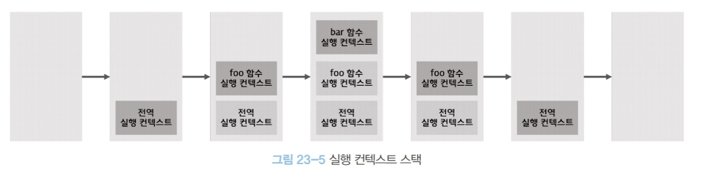
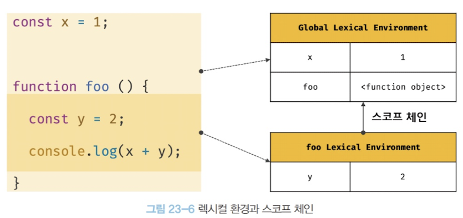
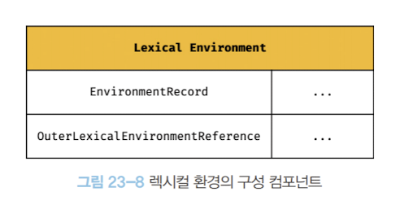

# 23. 실행 컨텍스트 (execution context)

실행컨텍스트는 JS의 동작 원리를 담고 있는 핵심 개념이다.

## 23.1 소스코드 타입

ECMAScript 사양은 소스코드를 4가지 타입으로 구분한다.

1. 전역 코드: 전역에 존재하는 소스코드. 전역에 정의된 함수, 클래스 등의 내부 코드는 포함되지 않는다.
2. 함수 코드: 함수 내부에 존재하는 소스코드. 함수 내부에 중첩된 함수, 클래스 등의 내부 코드는 포함되지 않는다.
3. eval 코드: 빌트인 전역 함수인 eval 함수에 인수로 전달되어 실행되는 소스코드
4. 모듈 코드: 모듈 내부에 존재하는 소스코드. 모듈 내부의 함수, 클래스 등의 내부 코드는 포함되지 않는다

## 23.2 소스코드의 평가와 실행

모든 소스 코드는 실행에 앞서 평가 과정을 거친다.

소스코드 평가 과정에서는 실행 컨텍스트를 생성하고 변수, 함수 등의 선언문만 먼저 실행하여 생성된 변수나 함수 식별자를 키로 실행 컨텍스트가 관리하는 스코프(렉시컬 환경의 레코드)에 등록한다.

평가 과정이 끝나면 비로소 선언문을 제외한 소스코드가 순차적으로 실행되기 시작한다. (런타임) 이때 소스코드 실행에 필요한 정보(변수나 함수의 참조)는 실행 컨텍스트가 관리하는 스코프에 검색해서 취득한다. 그리고 소스코드의 실행 결과는 다시 실행 컨텍스트가 관리하는 스코프에 등록된다.


## 23.3 실행 컨텍스트의 역할

아래의 코드는 전역 코드와 함수 코드로 구성되어 있다. JS엔진이 이를 어떻게 평가하고 실행하는지 살펴보자.

```javascript
// 전역 변수 선언
const x = 1;
const y = 2;

// 함수 정의
function foo(a) {
  // 지역 변수 선언
  const x = 10;
  const y = 20;

  // 메서드 호출
  console.log(a + x + y); // 130
}

// 함수 호출
foo(10);

// 메서드 호출
console.log(x + y); // 3
```

1. 전역 코드 평가
   - var 키워드로 선언된 전역 변수와 함수 선언문으로 정의된 전역 함수는 전역 객체의 프로퍼티와 메서드가 된다.
2. 전역 코드 실행
   - 전역 코드가 순차적으로 실행된다. 함수가 호출되면 전역 코드의 실행을 일시 중단하고 코드 실행 순서를 변경하여 함수 내부로 진입한다.
3. 함수 코드 평가
   - 함수 호출에 의해 코드 실행 순서가 변경되어 함수 내부로 진입하면 함수 내부의 문들을 실행하기 전에 함수 코드를 실행하기 위한 준비를 한다.
   - 준비: 매개변수, 지역 변수 선언문 먼저 실행되고, 이것이 지역 스코프에 등록되고, arguments 객체가 생성되어 지역 스코프에 등록되고 this 바인딩도 결정된다.
4. 함수 코드 실행
   - 함수 코드 평가가 끝나면 런타임이 시작되어 함수 코드가 순차 실행된다.

이처럼 코드가 실행되려면 다음과 같이 스코프, 식별자, 코드 실행 순서 등의 관리가 필요하다.

1. 선언에 의해 생성된 모든 식별자를 스코프에 구분하여 등록하고 상태 변화를 관리할 수 있어야 한다.
2. 스코프는 중첩 관계에 의해 스코프 체인을 형성해야 한다. (스코프 체인을 통해 상위 스코프로 이동하며 식별자를 검색)
3. 현재 실행 중인 코드의 실행 순서를 변경하고 다시 되돌아갈 수 있어야 한다. (ex. 함수 호출)

-> 이 모든 것을 관리하는 것이 **실행 컨텍스트**다!

- 실행 컨텍스트는 소스코드를 실행하는 데 필요한 환경을 제공하고 코드의 실행 결과를 실제로 관리하는 영역이다.
- **실행컨텍스트는 식별자를 등록하고 관리하는 스코프와 코드 실행 순서 관리를 구현한 내부 메커니즘으로, 모든 코드는 실행 컨텍스트를 통해 실행되고 관리된다.**
  - 식별자와 스코프 - 실행 컨텍스트의 '렉시컬 환경'으로 관리
  - 코드 실행 순서 - '실행 컨텍스트 스택'으로 관리

## 23.4 실행 컨텍스트 스택

```javascript
const x = 1;

function foo() {
  const y = 2;

  function bar() {
    const z = 3;
    console.log(x + y + z);
  }
  bar();
}

foo();
```

위 예제는 소스코드의 타입으로 분류하면 전역코드와 함수 코드로 이루어져 있다. JS 엔진은 먼저 전역 코드를 평가하여 전역 실행 컨텍스트를 생성하고, 함수가 호출되면 함수 코드를 평가하여 함수 실행 컨텍스트를 생성한다.



- 실행 컨텍스트는 스택 자료 구조로 관리: **실행 컨텍스트 스택**
- 실행 컨텍스트 스택은 코드의 실행 순서를 관리한다.
- 실행 컨텍스트 스택의 최상위에 존재하는 컨텍스트: **실행 중인 실행 컨텍스트(running execution context)**

## 23.5 렉시컬 환경 (Lexical Environment)

렉시컬 환경: 식별자와 식별자에 바인딩된 값, 그리고 상위 스코프에 대한 참조를 기록하는 자료구조로 실행 컨텍스트를 구성하는 컴포넌트다.

실행 컨텍스트 스택이 코드의 실행 순서를 관리한다면, 렉시컬 환경은 스코프와 식별자를 관리한다.



렉시컬 환경은 키와 값을 갖는 객체의 스코프를 생성하여 식별자를 키로 등록하고 식별자에 바인딩 된 값을 관리한다.

렉시컬 환경은 다음과 같이 두 개의 컴포넌트로 구성된다.

1. 환경 레코드 (Environment Record)
   - 스코프에 포함된 식별자를 등록하고 등록된 식별자에 바인딩된 값을 관리하는 저장소
2. 외부 렉시컬 환경에 대한 참조 (Outer Lexical Environment Reference)
   - 상위 스코프를 가리킨다. 해당 실행 컨텍스트를 생성한 소스코드를 포함하는 상위 코드의 렉시컬 환경.
     

## 23.6 실행 컨텍스트의 생성과 식별자 검색 과정

```javascript
car x = 1;
const y = 2;

function foo (a) {
  var x = 3;
  const y = 4;

  function bar (b) {
    const z = 5;
    console.log(a + b + x + y + z);
  }
  bar(10);
}

foo(20);  // 42
```

위 예제를 통해 실행 컨텍스트가 생성되고 관리되는 과정을 알아보자!

### 1. 전역 객체 생성

전역 객체는 전역 코드가 평가되기 이전에 생성된다.
전역 객체도 프로토타입 체인의 일원이다.

### 2. 전역 코드 평가

소스코드가 로드되면 JS엔진은 다음과 같은 순서로 전역 코드를 평가한다.

1. 전역 실행 컨텍스트 생성
2. 전역 렉시컬 환경 생성
   - 2.1 전역 환경 레코드 생성
     - 2.1.1 객체 환경 레코드 생성
     - 2.1.2 선언적 환경 레코드 생성
   - 2.2 this 바인딩
   - 2.3 외부 렉시컬 환경에 대한 참조 결정

### 3. 전역 코드 실행

전역 코드가 순차적으로 실행되기 시작한다.
변수 할당문이 실행되어 전역 변수 x, y에 값이 할당되고 foo 함수가 호출된다.

이때 만약 동일한 이름의 식별자가 다른 스코프에 여러 개 존재한다면, 어느 스코프의 식별자를 참조할지 결정하는데 이를 **식별자 결정**(identifier resolution)이라 한다.

식별자 결정을 위해 식별자를 검색할 때는 실행 중인 실행 컨텍스트에서 식별자를 검색하기 시작한다. 만약 실행 중인 실행 컨텍스트의 렉시컬 환경에서 식별자를 검색할 수 없으면 외부 렉시컬 환경에 대한 참조가 가리키는 렉시컬 환경, 즉 상위 스코프로 이동하여 식별자를 검색한다. - 스코프 체인의 동작 원리!

전역 렉시컬 환경에서 검색할 수 없는 식별자는 참조 에러(ReferenceError)를 발생시킨다.

### 4. foo 함수 코드 평가

1. 함수 실행 컨텍스트 생성
2. 함수 렉시컬 환경 생성
   - 2.1 함수 환경 레코드 생성
   - 2.2 this 바인딩
   - 2.3 외부 렉시컬 환경에 대한 참조 결정

### 5. foo 함수 코드 실행

런타임이 시작되어 foo 함수의 소스코드가 순차적으로 실행되기 시작한다.
매개변수에 인수 할당, 변수 할당문이 실행되어 지역 변수 x, y에 값이 할당되고 함수 bar가 호출된다.
식별자 결정을 위해 실행 중인 실행 컨텍스트의 렉시컬 환경에서 식별자를 검색하기 시작한다.

### 6. bar 함수 코드 평가

bar 함수가 호출되면 bar 함수 내부로 코드의 제어권이 이동한다. 그리고 bar 함수 코드를 평가하기 시작한다.

### 7. bar 함수 실행 코드 종료

런타임이 시작되어 bar 함수의 소스코드가 순차적으로 실행되기 시작한다.
매개변수에 인수가 할당되고, 변수 할당문이 실행되어 지역 변수 z에 값이 할당된다.
그리고 console.log(a + b + x + y + z); 가 실행딘다.

### 8. bar 함수 코드 실행 종료

실행 컨텍스트 스택에서 bar 함수 실행 컨텍스트가 팝되어 제거되고 foo 실행 컨텍스트가 실행 중인 실행 컨텍스트가 된다.

이때 bar 함수 렉시컬 환경까지 즉시 소멸하는 것은 아니다. 렉시컬 환경은 실행 컨텍스트에 의해 참조되기는 하지만 독립적인 객체다. 객체를 포함한 모든 값은 누군가에 의해 참조되지 않았을 때 가비지 컬렉터에 의해 메모리 공간 확보가 해제되어 소멸한다.

### 9. foo 함수 코드 실행 종료

bar 함수가 종료하면 더 이상 실행할 코드가 없으므로 foo 함수 코드의 실행이 종료된다.
foo 함수 실행 컨텍스트가 팝 되고 전역 실행 컨텍스트가 실행 중인 실행 컨텍스트가 된다.

### 10. 전역 코드 실행 종료

전역 코드 실행이 종료되고 전역 실행 컨텍스트도 팝 되어 실행 컨텍스트 스택에는 아무 것도 남아있지 않게 된다.

## 23.7 실행 컨텍스트와 블록 레벨 스코프

- var 키워드로 선언한 변수는 함수 레벨 스코프(함수의 코드 블록만 지역 스코프로 인정)
- let, const 키워드로 선언한 변수는 블록 레벨 스코프(모든 코드 블록을 지역 스코프로 인정)

```javascript
let x = 1;
if (true) {
  let x = 10;
  console.log(x); // 10
}
console.log(x); // 1
```

1. if 문의 코드 블록이 실행되면 블록 레벨 스코프 생성
2. 새로운 렉시컬 환경이 생성되어 기존의 전역 렉시컬 환경을 교체. 새로운 렉시컬 환경의 외부 참조는 if문이 실행되기 이전의 전역 렉시컬 환경을 가리킴.
