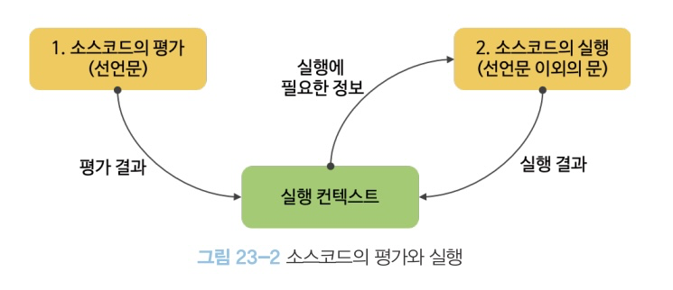

# 23. 실행 컨텍스트 (execution context)

실행컨텍스트는 JS의 동작 원리를 담고 있는 핵심 개념이다.

## 23.1 소스코드 타입

ECMAScript 사양은 소스코드를 4가지 타입으로 구분한다.

1. 전역 코드: 전역에 존재하는 소스코드. 전역에 정의된 함수, 클래스 등의 내부 코드는 포함되지 않는다.
2. 함수 코드: 함수 내부에 존재하는 소스코드. 함수 내부에 중첩된 함수, 클래스 등의 내부 코드는 포함되지 않는다.
3. eval 코드: 빌트인 전역 함수인 eval 함수에 인수로 전달되어 실행되는 소스코드
4. 모듈 코드: 모듈 내부에 존재하는 소스코드. 모듈 내부의 함수, 클래스 등의 내부 코드는 포함되지 않는다

## 23.2 소스코드의 평가와 실행

모든 소스 코드는 실행에 앞서 평가 과정을 거친다.

소스코드 평가 과정에서는 실행 컨텍스트를 생성하고 변수, 함수 등의 선언문만 먼저 실행하여 생성된 변수나 함수 식별자를 키로 실행 컨텍스트가 관리하는 스코프(렉시컬 환경의 레코드)에 등록한다.

평가 과정이 끝나면 비로소 선언문을 제외한 소스코드가 순차적으로 실행되기 시작한다. (런타임) 이때 소스코드 실행에 필요한 정보(변수나 함수의 참조)는 실행 컨텍스트가 관리하는 스코프에 검색해서 취득한다. 그리고 소스코드의 실행 결과는 다시 실행 컨텍스트가 관리하는 스코프에 등록된다.


## 23.3 실행 컨텍스트의 역할

아래의 코드는 전역 코드와 함수 코드로 구성되어 있다. JS엔진이 이를 어떻게 평가하고 실행하는지 살펴보자.

```javascript
// 전역 변수 선언
const x = 1;
const y = 2;

// 함수 정의
function foo(a) {
  // 지역 변수 선언
  const x = 10;
  const y = 20;

  // 메서드 호출
  console.log(a + x + y); // 130
}

// 함수 호출
foo(10);

// 메서드 호출
console.log(x + y); // 3
```

1. 전역 코드 평가
   - var 키워드로 선언된 전역 변수와 함수 선언문으로 정의된 전역 함수는 전역 객체의 프로퍼티와 메서드가 된다.
2. 전역 코드 실행
   - 전역 코드가 순차적으로 실행된다. 함수가 호출되면 전역 코드의 실행을 일시 중단하고 코드 실행 순서를 변경하여 함수 내부로 진입한다.
3. 함수 코드 평가
   - 함수 호출에 의해 코드 실행 순서가 변경되어 함수 내부로 진입하면 함수 내부의 문들을 실행하기 전에 함수 코드를 실행하기 위한 준비를 한다.
   - 준비: 매개변수, 지역 변수 선언문 먼저 실행되고, 이것이 지역 스코프에 등록되고, arguments 객체가 생성되어 지역 스코프에 등록되고 this 바인딩도 결정된다.
4. 함수 코드 실행
   - 함수 코드 평가가 끝나면 런타임이 시작되어 함수 코드가 순차 실행된다.

이처럼 코드가 실행되려면 다음과 같이 스코프, 식별자, 코드 실행 순서 등의 관리가 필요하다.

1. 선언에 의해 생성된 모든 식별자를 스코프에 구분하여 등록하고 상태 변화를 관리할 수 있어야 한다.
2. 스코프는 중첩 관계에 의해 스코프 체인을 형성해야 한다. (스코프 체인을 통해 상위 스코프로 이동하며 식별자를 검색)
3. 현재 실행 중인 코드의 실행 순서를 변경하고 다시 되돌아갈 수 있어야 한다. (ex. 함수 호출)

-> 이 모든 것을 관리하는 것이 **실행 컨텍스트**다!

- 실행 컨텍스트는 소스코드를 실행하는 데 필요한 환경을 제공하고 코드의 실행 결과를 실제로 관리하는 영역이다.
- **실행컨텍스트는 식별자를 등록하고 관리하는 스코프와 코드 실행 순서 관리를 구현한 내부 메커니즘으로, 모든 코드는 실행 컨텍스트를 통해 실행되고 관리된다.**
  - 식별자와 스코프 - 실행 컨텍스트의 '렉시컬 환경'으로 관리
  - 코드 실행 순서 - '실행 컨텍스트 스택'으로 관리

## 23.4 실행 컨텍스트 스택
