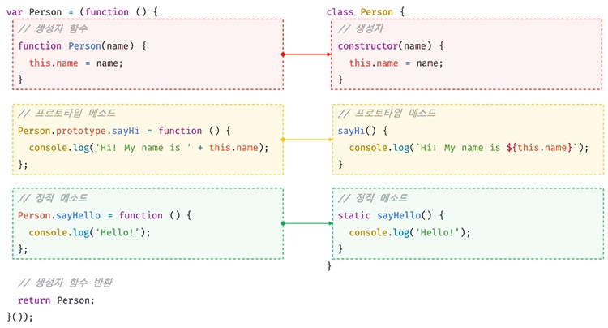

# 25. 클래스

## 클래스는 프로토타입의 문법적 설탕인가?

자바스크립트는 프로토타입 기반 객체지향 언어다. 다른 객체지향 언어와의 차이점이 있긴 하지만 자바스크립트도 강력한 객체지향 프로그래밍 능력을 지니고 있다

프로토타입 기반 객체지향 언어는 클래스가 필요 없는 (class free) 객체지향 프로그래밍 언어다.

```javascript
// ES5 생성자 함수
var Person = (function () {
  // 생성자 함수
  function Person(name) {
    this.name = name;
  }

  // 프로토타입 메서드
  Person.prototype.sayHi = function () {
    console.log("Hi! My name is " + this.name);
  };

  // 생성자 함수 반환
  return Person;
})();

// 인스턴스 생성
var me = new Person("Lee");
me.sayHi(); // Hi! My name is Lee
```

위와 같이 객체지향의 상속을 구현할 수 있다.
하지만 이와같은 JS의 특징은 클래스 기반 언어에 익숙한 프로그래머들에게 혼란을 줄 수 있다. 이에 따라 ES6에서는 클래스가 도입되었다. 하지만 자바스크립트의 클래스는 함수이며, 기존 프로토타입 기반 패턴들을 클래스 기반 패턴처럼 사용할 수 있도록 하는 문법적 설탕이라 볼 수 있다.

클래스는 생성자 함수와 매우 유사하게 동작하지만 차이가 있다.

1. 클래스를 new 연산자 없이 호출하면 에러가 발생하지만 생성자 함수를 new 연산자 없이 호출하면 일반 함수로서 호출된다.
2. 클래스는 상속을 지원하는 extends와 super 키워드를 제공한다. 하지만 생성자 함수는 지원하지 않는다.
3. 클래스는 호이스팅이 발생하지 않는 것처럼 동작한다. 하지만 함수 선언문으로 정의된 생성자 함수는 함수 호이스팅이, 함수 표현식으로 정의한 생성자 함수는 변수 호이스팅이 발생한다.
4. 클래스 내의 모든 코드에는 암묵적으로 strict mode가 지정되어 실행되며 strict mode를 해제할 수 없다. 하지만 생성자 함수는 암묵적으로 strict mode가 지정되지 않는다.
5. 클래스의 constructor, 프로토타입 메서드, 정적 메서드는 모두 프로퍼티 어트리뷰트 [[Enumerable]]의 값이 false다. 다시 말해 열거되지 않는다.

클래스를 다눈한 문법적 설탕이라고 보기보다는 새로운 객체 생성 메커니즘으로 보는 것이 더 좋다.

## 클래스 정의

```javascript
// 클래스 선언문
class Person {}
```

클래스는 class 키워드를 사용하여 정의하며 파스칼 케이스를 사용하는 것이 일반적이다.

표현식으로도 클래스를 정의할 수도 있다.

```javascript
// 익명 클래스 표현식
const Person = class {};

// 기명 클래스 표현식
const Person = class MyClass {};
```

클래스를 표현식으로 정의할 수 있다는 것은 클래스가 값으로 사용할 수 있다는 일급 객체라는 것을 의미한다.

클래스는 함수이기 때문에 일급 객체가 된다.

```javascript
// 클래스 선언문
class Person {
  // 생성자
  constructor(name) {
    // 인스턴스 생성 및 초기화
    this.name = name; // name 프로퍼티는 public하다.
  }

  // 프로토타입 메서드
  sayHi() {
    console.log(`Hi! My name is ${this.name}`);
  }

  // 정적 메서드
  static sayHello() {
    console.log("Hello!");
  }
}

// 인스턴스 생성
const me = new Person("Lee");

// 인스턴스의 프로퍼티 참조
console.log(me.name); // Lee
// 프로토타입 메서드 호출
me.sayHi(); // Hi! My name is Lee
// 정적 메서드 호출
Person.sayHello(); // Hello!
```

클래스 몸체에는 0개 이상의 메서드만 정의할 수 있다. 클래스 몸체에서 정의할 수 있는 메서드는 constructor(생성자), 프로토타입 메서드, 정적 메서드의 세 가지가 있다.


클래스와 생성자 함수의 정의 방식은 형태적인 면에서 매우 유사하다.

## 클래스 호이스팅

클래스는 함수로 평가된다.

```javascript
// 클래스 선언문
class Person {}

console.log(typeof Person); // function
```

클래스 선언문으로 정의한 클래스는 함수 선언문과 같이 소스코드 평가 과정, 즉 런타임 이전에 먼저 평가되어 함수 객체를 생성한다. 이때 클래스가 평가되어 생성된 함수 객체는 생성자 함수로서 호출할 수 있는 함수, 즉 constructor 이다.

단, 클래스는 클래스 정의 이전에 참조할 수 없다.

```javascript
console.log(Person);
// ReferenceError: Cannot access 'Person' before initialization

// 클래스 선언문
class Person {}
```

이렇게 클래스 선언문은 마치 호이스팅이 발생하지 않는 것처럼 보인다. 하지만 그렇지 않다.

```javascript
const Person = "";

{
  // 호이스팅이 발생하지 않는다면 ''이 출력되어야 한다.
  console.log(Person);
  // ReferenceError: Cannot access 'Person' before initialization

  // 클래스 선언문
  class Person {}
}
```

클래스도 let, const 키워드처럼 클래스 선언문 이전에 일시적 사각지대에 빠지기 때문에 호이스팅이 발생하지 않는 것처럼 보이게 된다.

## 인스턴스 생성

클래스는 생성자 함수이며 new 연산자와 함께 호출되어 인스턴스를 생성한다.

```javascript
class Person {}

// 인스턴스 생성
const me = new Person();
console.log(me); // Person {}
```

클래스는 인스턴스를 생성하는 것이 유일한 존재 이유이므로 반드시 new 연산자와 함께 호출해야 한다.

```javascript
class Person {}

// 클래스를 new 연산자 없이 호출하면 타입 에러가 발생한다.
const me = Person();
// TypeError: Class constructor Person cannot be invoked without 'new'
```

클래스 표현식으로 정의된 클래스의 경우 다음 예제와 같이 클래스를 가리키는 식별자(Person)를 사용해 인스턴스를 생성하지 않고 기명 클래스 표현식의 클래스 이름(MyClass)을 사용해 인스턴스를 생성하면 에러가 발생한다.

이는 기명 함수 표현식과 마찬가지로 클래스 표현식에서 사용한 클래스 이름은 외부 코드에서 접근 불가능하기 때문이다.

```javascript
const Person = class MyClass {};

// 함수 표현식과 마찬가지로 클래스를 가리키는 식별자로 인스턴스를 생성해야 한다.
const me = new Person();

// 클래스 이름 MyClass는 함수와 동일하게 클래스 몸체 내부에서만 유효한 식별자다.
console.log(MyClass); // ReferenceError: MyClass is not defined

const you = new MyClass(); // ReferenceError: MyClass is not defined
```

## 메서드

클래스 몸체에서 정의할 수 있는 메서드는 constructor(생성자), 프로토타입 메서드, 정적 메서드 세 가지가 있다.

> _ECMAScript사양에 따르면 인스턴스 프로퍼티는 반드시 constructor 내부에서 정의해야 한다. 하지만 클래스 몸체에 메서드 뿐 아니라 프로퍼티를 직접 정의할 수 있는 새로운 표준 사양이 제안되어 있으며 머지않아 클래스 몸체에서 메서드 뿐 아니라 프로퍼티도 정의할 수 있게 될 것으로 보인다._

### constructor

constructor: 인스턴스를 생성하고 초기화하기 위한 특수한 메서드.
constructor는 이름을 변경할 수 없다.

```javascript
class Person {
  // 생성자
  constructor(name) {
    // 인스턴스 생성 및 초기화
    this.name = name;
  }
}
```

클래스는 인스턴스를 생성하기 위한 생성자 함수다.
클래스는 함수 객체가 되며 함수와 동일하게 프로토타입과 연결되어 있고 자신의 스코프 체인을 구성한다.

```javascript
// 클래스
class Person {
  // 생성자
  constructor(name) {
    // 인스턴스 생성 및 초기화
    this.name = name;
  }
}

// 생성자 함수
function Person(name) {
  // 인스턴스 생성 및 초기화
  this.name = name;
}
```

클래스가 평가되어 생성한 함수 객체나 클래스가 생성한 인스턴스 어디에도 constructor 메서드가 보이지 않는데, 이는 클래스 몸체에 정의한 constructor가 단순한 메서드가 아니라는 것을 의미한다.

constructor는 메서드로 해석되는 것이 아니라 클래스가 평가되어 생성한 함수 객체 코드의 일부가 된다. 다시 말해, 클래스 정의가 평가되어 constructor의 기술된 동작을 하는 함수 객체가 생성된다.

constructor는 생성자 함수와 유사하지만 몇 가지 차이가 있다.

- constructor는 클래스 내에 최대 한 개만 존재할 수 있으며 생략할 수 있다.

```javascript
class Person {
  constructor() {}
  constructor() {}
}
// SyntaxError: A class may only have one constructor
```

- constructor를 생략하면 빈 constructor가 암묵적으로 정의된다.

```javascript
class Person {
  // constructor를 생략하면 다음과 같이 빈 constructor가 암묵적으로 정의된다.
  constructor() {}
}

// 빈 객체가 생성된다.
const me = new Person();
console.log(me); // Person {}
```

- 만약 프로퍼티가 추가되어 초기화된 인스턴스를 생성하려면 constructor 내부에서 this에 인스턴스 프로퍼티를 추가하면 된다.

```javascript
class Person {
  constructor() {
    // 고정값으로 인스턴스 초기화
    this.name = "Lee";
    this.address = "Seoul";
  }
}

// 인스턴스 프로퍼티가 추가된다.
const me = new Person();
console.log(me); // Person {name: "Lee", address: "Seoul"}
```

- 인스턴스를 생성할 때 클래스 외부에서 인스턴스 프로퍼티의 초기값을 전달하려면 매개변수를 선언하고 인스턴스를 생성할 때 초기값을 전달하면 된다. 이때 초기값은 constructor의 매개변수에게 전달된다.

```javascript
class Person {
  constructor(name, address) {
    // 인수로 인스턴스 초기화
    this.name = name;
    this.address = address;
  }
}

// 인수로 초기값을 전달한다. 초기값은 constructor에 전달된다.
const me = new Person("Lee", "Seoul");
console.log(me); // Person {name: "Lee", address: "Seoul"}
```

- constructor는 별도의 반환문을 갖지 않아야 한다. new 연산자와 함께 클래스가 호출되면 생성자 함수와 동일하게 암묵적으로 this, 즉 인스턴스를 반환하기 때문이다. 만약 다른 객체를 명시적으로 반환하면 인스턴스가 반환되지 못하고 return문에 명시된 객체가 반환된다.

```javascript
class Person {
  constructor(name) {
    this.name = name;

    // 명시적으로 객체를 반환하면 암묵적인 this 반환이 무시된다.
    return {};
  }
}

// constructor에서 명시적으로 반환한 빈 객체가 반환된다.
const me = new Person("Lee");
console.log(me); // {}
```

이러한 동작은 클래스의 기본 동작을 훼손하므로 return문은 반드시 사용하지 않아야 한다!

### 프로토타입 메서드

생성자 함수를 사용하여 인스턴스를 생성하는 경우 프로토타입 메서드를 생성하기 위해서는 아래와 같이 명시적으로 프로토타입에 메서드를 추가해줘야 한다.

```javascript
// 생성자 함수
function Person(name) {
  this.name = name;
}

// 프로토타입 메서드
Person.prototype.sayHi = function () {
  console.log(`Hi! My name is ${this.name}`);
};

const me = new Person("Lee");
me.sayHi(); // Hi! My name is Lee
```

클래스 몸체에서 정의한 메서드는 생성자 함수에 의한 객체 생성과는 다르게 클래스의 prototype 프로퍼티에 메서드를 추가하지 않아도 기본적으로 프로토타입 메서드가 된다.

```javascript
class Person {
  // 생성자
  constructor(name) {
    // 인스턴스 생성 및 초기화
    this.name = name;
  }

  // 프로토타입 메서드
  sayHi() {
    console.log(`Hi! My name is ${this.name}`);
  }
}

const me = new Person("Lee");
me.sayHi(); // Hi! My name is Lee
```

생성자 함수와 마찬가지로 클래스가 생성한 인스턴스는 프로토타입 체인의 일원이 된다.

클래스 몸체에 정의한 메서드는 인스턴스의 프로토타입에 존재하는 프로토타입 메서드가 되며 인스턴스는 프로토타입 메서드를 상속받아 사용하는 것이 가능하다.

### 정적 메서드

정적 메서드: 인스턴스를 생성하지 않아도 호출할 수 있는 메서드

```javascript
// 생성자 함수
function Person(name) {
  this.name = name;
}

// 정적 메서드
Person.sayHi = function () {
  console.log("Hi!");
};

// 정적 메서드 호출
Person.sayHi(); // Hi!
```

생성자 함수와 달리 클래스에서는 메서드에 static 키워드를 붙이면 정적 메서드가 된다.

```javascript
class Person {
  // 생성자
  constructor(name) {
    // 인스턴스 생성 및 초기화
    this.name = name;
  }

  // 정적 메서드
  static sayHi() {
    console.log("Hi!");
  }
}
```

정적 메서드는 클래스에 바인딩된 메서드가 되며 클래스는 함수 객체로 평가되므로 자신의 프로퍼티/메서드를 소유하는 것이 가능하다. 클래스 정의가 평가되는 시점에 함수 객체가 되므로 별도의 생성과정이 필요 없다.

따라서 정적 메서드는 프로토타입 메서드처럼 인스턴스로 호출하지 않고 클래스로 호출해야하며 인스턴스로 호출할 수 없다. 인스턴스의 프로토타입 체인 상에는 클래스가 존재하지 않기 떄문에 인스턴스로 클래스의 메서드를 상속받을 수 없다.

```javascript
// 정적 메서드는 클래스로 호출한다.
// 정적 메서드는 인스턴스 없이도 호출할 수 있다.
Person.sayHi(); // Hi!
```

```javascript
// 인스턴스 생성
const me = new Person("Lee");
me.sayHi(); // TypeError: me.sayHi is not a function
```

### 정적 메서드와 프로토타입 메서드의 차이

1.정적 메서드와 프로토타입 메서드는 자신이 속해 있는 프로토타입 체인이 다르다. 2. 정적 메서드는 클래스로 호출하고 프로토타입 메서드는 인스턴스로 호출한다. 3. 정적 메서드는 인스턴스 프로퍼티를 참조할 수 없지만 프로토타입 메서드는 인스턴스 프로퍼티를 참조할 수 있다.

```javascript
class Square {
  // 정적 메서드
  static area(width, height) {
    return width * height;
  }
}

console.log(Square.area(10, 10)); // 100
```

```javascript
class Square {
  constructor(width, height) {
    this.width = width;
    this.height = height;
  }

  // 프로토타입 메서드
  area() {
    return this.width * this.height;
  }
}

const square = new Square(10, 10);
console.log(square.area()); // 100
```

위 두 예제를 보면, 정적 메서드는 클래스로 호출해야 하므로 정적 메서드 내부의 this는 인스턴스가 아닌 클래스를 가리킨다. 즉 프로토타입 메서드와 정적 메서드 내부의 this 바인딩이 다르다.

따라서 메서드 내부에서 인스턴스 프로퍼티를 참조할 필요가 있다면 this를 사용해야 하며 프로토타입 메서드로 정의해야 한다.
this를 사용하지 않는다면 인스턴스를 생성한 다음 호출해야 하는 프로토타입 메서드보다는 정적 메서드로 정의하는 것이 좋다.

표준 빌트인 객체인 Math, Number, JSON, Object, Reflect 등은 다양한 정적 메서드를 가지고 있다. 이러한 정적 메서드는 애플리케이션 전역에서 사용할 유틸리티 함수를 전역 함수로 정의하지 않고 메서드로 구조화할 때 유용하다.

```javascript
// 표준 빌트인 객체의 정적 메서드
Math.max(1, 2, 3); // -> 3
Number.isNaN(NaN); // -> true
JSON.stringify({ a: 1 }); // -> "{"a":1}"
Object.is({}, {}); // -> false
Reflect.has({ a: 1 }, "a"); // -> true
```

### 클래스에서 정의한 메서드의 특징

1. function 키워드를 생략한 메서드 축약 표현을 사용한다.
2. 객체 리터럴과는 다르게 콤마가 필요 없다.
3. 암묵적으로 strict mode로 실행된다.
4. for...in 문이나 Object.keys 메서드 등으로 열거할 수 없다. 즉, 프로퍼티 어트리뷰트 [[Enumerable]]의 값이 false다.
5. non-constructor이다. 즉, 내부 메서드 [[Construct]]를 갖지 않으며, new 연산자와 함게 호출할 수 없다.

## 클래스의 인스턴스 생성 과정

1. 인스턴스 생성과 this 바인딩
2. 인스턴스 초기화
3. 인스턴스 반환

```javascript
class Person {
  // 생성자
  constructor(name) {
    // 1. 암묵적으로 인스턴스 생섣되고 this에 바인딩됨
    console.log(this); // Person {}
    console.log(Object.getPrototypeOf(this) === Person.prototype); // true

    // 2. this에 바인딩되어 있는 인스턴스를 초기화한다.
    this.name = name;

    // 3. 완성된 인스턴스가 바인딩된 this가 암묵적으로 반환된다.
  }
}
```

## 25.7 프로퍼티

- 인스턴스 프로퍼티:
  인스턴스 프로퍼티는 constructor 내부에서 정의.
  - constructor 코드가 실행되기 전에는 암묵적으로 생성된 빈 객체가 인스턴스로써 존재. constructor 코드가 실행되어 인스턴스에 프로퍼티를 추가하면서 초기화.

```javascript
class Person {
  constructor(name) {
    // 인스턴스 프로퍼티
    this.name = name;
  }
}

const me = new Person("Lee");
console.log(me); // Person {name: "Lee"}
```

- 접근자 프로퍼티: 접근자 프로퍼티는 자체적으로는 값을 갖지 않는다. 다른 데이터 프로퍼티의 값을 읽거나 저장할 때 사용하는 접근자 함수로 구성된 프로퍼티.

- 클래스 필드 정의 제안: 클래스 기반 객체지향 언어에서 클래스가 생성할 인스턴스의 프로퍼티.
  - 클래스 몸체에서 클래스 필드를 정의하려면 this에 바인딩하면 안된다. this는 constructor와 메서드 내에서만 유효.
  - 초기값을 할당하지 않으면 undefined.
  - constructor 내부에서만 초기화해야 한다.
  - 클래스 필드에 함수를 할당하면 인스턴스 메서드가 된다. 따라서 클래스 필드에 함수 할당은 비권장사항이다.
- pivate 필드 정의 제안: #을 사용하여 private을 정의할 수 있는 표준 사양이 TC39 프로세스의 stage 3에서 제안되었다.

- static 필드 정의 제안: TC39 프로세스의 stage 3에서 “Static class features”가 제안되었다. static public 필드, static private 필드, static private 메서드를 정의할 수 있다.

## 25.8 상속에 의한 클래스 확장

기존 클래스를 상속받아 새로운 클래스를 확장하여 정의하는 것

- extends 키워드를 통해 클래스 / 생성자 함수를 상속받아 클래스 확장

```javascript
// 수퍼(베이스/부모) 클래스
class Base {}
// 서브(파생/자식) 클래스
class Derived extends Base {}
```

- 동적 상속: 생성자 함수를 상속 받아 클래스를 확장

```javascript
// 생성자 함수
function Base(a) {
  this.a = a;
}
// 생성자 함수를 상속받는 서브클래스
class Derived extends Base {}
```

- 서브 클래스의 constructor: 클래스에서 constructor 생략하면 클래스에 비어 있는 consturctor가 암묵적으로 정의됨. 프로퍼티를 소유하는 인스턴스를 생성하려면 consturctor 내부에서 인스턴스에 프로퍼티를 추가해야 함.

```javascript
class Base {
  consturctor() {}
}
class Derived extends Base {
  consturctor(...args) {
    super(...args);
  }
}

const derived = new Derived();
console.log(derived); // Derived {}
```

- super 키워드: super 호출 시 수퍼클래스의 constructor (super-constructor)를 호출한다.

  - super 참조: 메서드 내에서 super를 참조하면 수퍼클래스의 메서드를 호출할 수 있다. super 참조를 통해 수퍼클래스의 메서드를 참조하려면 super가 수퍼 클래스의 prototype 프로퍼티에 바인딩된 프로토타입을 참조할 수 있어야 한다.
  - ES6의 메서드 축약 표현으로 정의된 함수만이 super 참조가 가능하다.

- 표준 빌트인 생성자 함수 확장: extends 키워드 다음에는 클래스뿐만이 아니라 [[Construct]] 내부 메서드를 갖는 함수 객체로 평가될 수 있는 모든 표현식을 사용할 수 있다.

```javascript
// Array 생성자 함수를 상속받아 확장한 MyArray
class MyArray extends Array {
  uniq() {
    return this.filter((v, i, self) => self.indexOf(v) === i);
  }

  average() {
    return this.reduce((pre, cur) => pre + cur, 0) / this.length;
  }
}

const myArray = new MyArray(1, 1, 2, 3);
console.log(myArray.uniq()); // MyArray(3) [1, 2, 3]
console.log(myArray.average()); // 1.75

console.log(myArray.filter((v) => v % 2) instanceof MyArray); // true

// 메서드 체이닝
console.log(
  myArray
    .filter((v) => v % 2)
    .uniq()
    .average()
); // 2
```

Array.prototype의 메서드 중에서 map, filter와 같이 새로운 배열을 반환하는 메서드가 MyArray 클래스의 인스턴스를 반환한다.

myArray.filter가 반환하는 인스턴스는 MyArray 클래스가 생성한 인스턴스인 MyArray 타입이다. 따라서 myArray.filter가 반환하는 인스턴스로 uniq 메서드를 연이어 호출(메서드 체이닝)할 수 있다.
